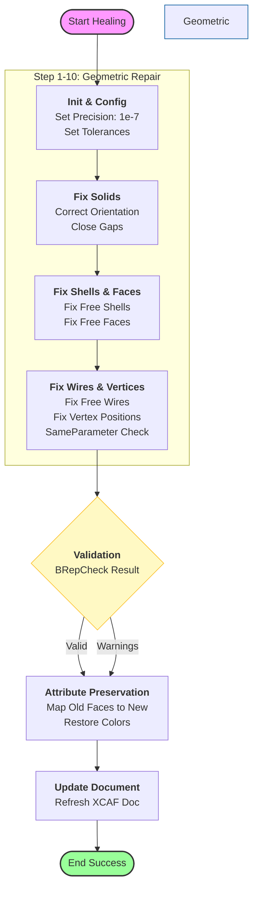

# Introduction 
The healing process is a comprehensive workflow designed to repair invalid CAD geometry. 

# Flowchart

```mermaid
flowchart TD
    Start([Start Healing]) --> Init[<b>Init & Config</b><br/>Set Precision: 1e-7<br/>Set Tolerances]
    
    subgraph Geometric Repair [Step 1-10: Geometric Repair]
        direction TB
        Init --> FixSolid[<b>Fix Solids</b><br/>Correct Orientation<br/>Close Gaps]
        FixSolid --> FixShell[<b>Fix Shells & Faces</b><br/>Fix Free Shells<br/>Fix Free Faces]
        FixShell --> FixWire[<b>Fix Wires & Vertices</b><br/>Fix Free Wires<br/>Fix Vertex Positions<br/>SameParameter Check]
    end
    
    FixWire --> Validation{<b>Validation</b><br/>BRepCheck Result}
    
    Validation -- Valid --> Step12
    Validation -- Warnings --> Step12[<b>Attribute Preservation</b><br/>Map Old Faces to New<br/>Restore Colors]
    
    Step12 --> UpdateDoc[<b>Update Document</b><br/>Refresh XCAF Doc]
    UpdateDoc --> Finish([End Success])
    
    style Start fill:#f9f,stroke:#333,stroke-width:2px
    style Finish fill:#9f9,stroke:#333,stroke-width:2px
    style Geometric Repair fill:#e1f5fe,stroke:#01579b
    style Validation fill:#fff9c4,stroke:#fbc02d
```